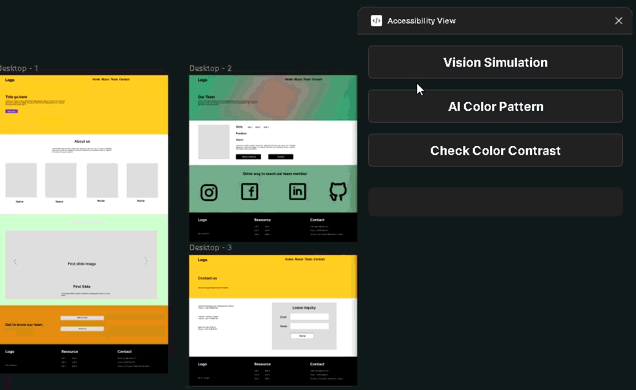

# Accessibility View - Figma Plugin

A comprehensive Figma plugin designed to enhance accessibility in design workflows by providing color contrast analysis, vision simulation for color blindness, and AI-powered color pattern generation.

## 🎯 Features

### 1. Color Contrast Analysis
- **Real-time contrast checking** for selected frames
- **WCAG compliance validation** (AA and AAA standards)
- **Interactive color adjustment** with live preview
- **Contrast ratio calculations** for text and background colors


### 2. Vision Simulation
Simulate how designs appear to users with different types of color blindness:
- **Protanopia** - Red-green color blindness (red deficiency)
- **Deuteranopia** - Red-green color blindness (green deficiency)  
- **Tritanopia** - Blue-yellow color blindness
- **Achromatopsia** - Complete color blindness (monochromatic vision)



### 3. AI Color Pattern Generation
- **AI-powered color palette generation** using external APIs
- **Multiple color schemes** for design inspiration
- **One-click color application** to selected frames
- **Real-time color preview** and selection


## 🚀 Installation

### For Development
1. Clone the repository:
   ```bash
   git clone https://github.com/phuocnguyen2201/accessibility-view.git
   cd accessibility-view
   ```

2. Install dependencies:
   ```bash
   npm install
   ```

3. Build the plugin:
   ```bash
   npm run build
   ```

4. In Figma:
   - Go to Plugins > Development > Import plugin from manifest
   - Select the `manifest.json` file from this project

### For Production
1. Build the plugin:
   ```bash
   npm run build
   ```

2. The built files will be in the `dist/` directory
3. Import the plugin using the `manifest.json` file

## 🛠️ Development

### Project Structure
```
accessibility-view/
├── constants/
│   └── constants.ts          # Application constants and messages
├── features/
│   ├── color-contrast.ts     # Color contrast analysis logic
│   ├── color-pattern.ts      # AI color pattern generation
│   └── vision-simulation.ts  # Color blindness simulation
├── src/
│   ├── code.ts              # Main plugin entry point
│   └── style.css            # Global styles
├── views/
│   ├── color-contrast.html   # Contrast analysis UI
│   ├── color-pattern.html    # Color pattern UI
│   └── vision_simulation.html # Vision simulation UI
├── manifest.json            # Plugin configuration
├── package.json             # Dependencies and scripts
└── webpack.config.js        # Build configuration
```

### Available Scripts
- `npm run build` - Build the plugin for production
- `npm run watch` - Build and watch for changes
- `npm run lint` - Run ESLint
- `npm run lint:fix` - Fix ESLint issues

### Technology Stack
- **TypeScript** - Type-safe development
- **Webpack** - Module bundling
- **Figma Plugin API** - Plugin functionality
- **ESLint** - Code quality and consistency

## 📖 Usage

### Color Contrast Analysis
1. Select a frame in your Figma document
2. Open the plugin and navigate to "Check Color Contrast"
3. View the contrast ratio and WCAG compliance status
4. Adjust colors interactively to improve accessibility

### Vision Simulation
1. Select a frame to simulate
2. Choose a color blindness type:
   - **Protanopia** - Difficulty distinguishing red and green
   - **Deuteranopia** - Most common form of color blindness
   - **Tritanopia** - Difficulty with blue and yellow
   - **Achromatopsia** - Complete color blindness
3. View the simulated appearance
4. Use "Clear" to remove simulation frames

### AI Color Pattern Generation
1. Navigate to "AI Pattern" in the plugin
2. Click "Generate" to create new color palettes
3. Click on any color to apply it to your selected frame
4. Generate new patterns as needed for inspiration

## 🎨 Features in Detail

### Color Contrast Analysis
The plugin calculates contrast ratios using the WCAG 2.1 formula and provides:
- **Contrast ratio display** with pass/fail indicators
- **WCAG AA and AAA compliance** checking
- **Large text and normal text** standards
- **Interactive color adjustment** with live updates

### Vision Simulation
Creates overlay frames showing how designs appear to users with color vision deficiencies:
- **Accurate color transformation** using established algorithms
- **Non-destructive simulation** (original design remains unchanged)
- **Multiple simulation types** for comprehensive testing
- **Easy clearing** of simulation frames

### AI Color Pattern Generation
Leverages AI to generate harmonious color palettes:
- **Multiple color schemes** per generation
- **One-click application** to selected frames
- **Real-time preview** of generated colors
- **Infinite generation** for design inspiration

## 🤝 Contributing

1. Fork the repository
2. Create a feature branch (`git checkout -b feature/amazing-feature`)
3. Commit your changes (`git commit -m 'Add amazing feature'`)
4. Push to the branch (`git push origin feature/amazing-feature`)
5. Open a Pull Request

### Development Guidelines
- Follow TypeScript best practices
- Use ESLint for code quality
- Test features thoroughly before submitting
- Update documentation for new features

## 📝 License

This project is licensed under the MIT License - see the LICENSE file for details.

## 🐛 Known Issues

- Color application requires frames with existing solid fills
- Vision simulation works best with high-contrast designs
- AI generation requires stable internet connection

## 🔮 Future Enhancements

- [ ] Support for gradient fills
- [ ] Additional color blindness types
- [ ] Custom color palette import/export
- [ ] Batch processing for multiple frames
- [ ] Integration with design systems
- [ ] Advanced contrast optimization suggestions

---

**Made with ❤️ for better accessibility in design**
