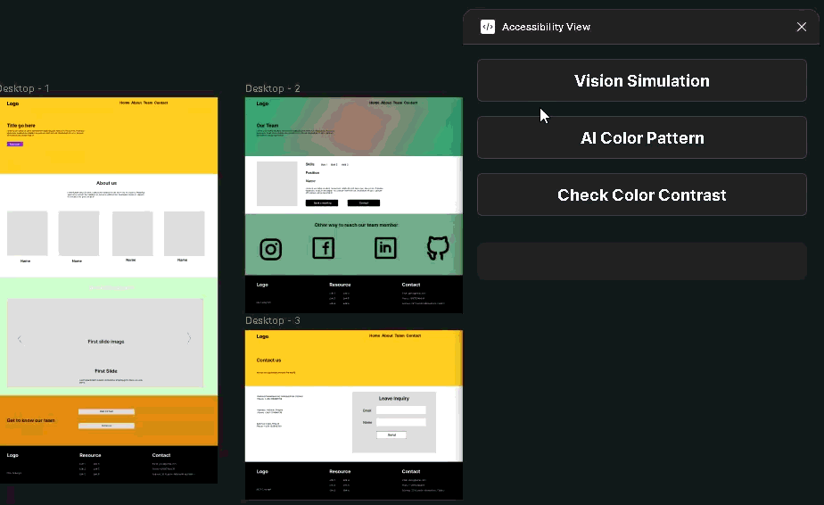

# Accessibility View - Figma Plugin

A comprehensive Figma plugin designed to enhance accessibility in design workflows by providing color contrast analysis, vision simulation for color blindness, non-text contrast checking, palette-wide audits, and accessible color pattern generation.

See [documentation/](documentation/README.md) for a per-feature technical reference (implementation details, message contracts, known limitations).

## 🎯 Features

### 1. Color Contrast Analysis
- **Real-time contrast checking** for selected frames
- **WCAG compliance validation** (AA and AAA standards)
- **Interactive color adjustment** with live preview
- **Contrast ratio calculations** for text and background colors


### 2. Vision Simulation
Simulate how designs appear to users with different types of color blindness:
- **Protanopia** - Red-green color blindness (red deficiency)
- **Deuteranopia** - Red-green color blindness (green deficiency)  
- **Tritanopia** - Blue-yellow color blindness
- **Achromatopsia** - Complete color blindness (monochromatic vision)



### 3. Color Pattern Generation (Light & Dark Theme)
- **Accessible color palette generation** using a deterministic HSL algorithm (no external API/AI calls)
- **WCAG-conformant by construction** — every color is binary-searched to meet the chosen AA/AAA × Normal/Large target instead of being filtered after the fact
- **Light theme and dark theme sets** generated together in one pass, scored against a white and a near-black (`#181A1B`) reference background respectively
- **One-click color application** to selected frames
- **Real-time color preview** and selection


### 4. Non-Text Contrast Checker
- **Scans icons, borders, and focus indicators** against WCAG 1.4.11's flat 3:1 minimum
- **Resolves effective background color** by walking up the parent chain, alpha-compositing solid fills
- **Decorative (`--decorative` suffix) and disabled-control exemptions**
- **Fail / Needs review / Pass grouping** with click-to-select-and-zoom, plus optional on-canvas badges

### 5. Palette Audit Mode
- **Scores every background/surface × text/accent-icon pair** across a file's local color styles at once
- **Role tagging** (Text, Background, Accent/Icon, Surface) persisted per-file
- **Smart fix suggestions** — hue/saturation-preserving lightness adjustments for failing pairs
- **CSV export** of the full contrast matrix for design-system documentation

## 🚀 Installation

### For Development
1. Clone the repository:
   ```bash
   git clone https://github.com/phuocnguyen2201/accessibility-view.git
   cd accessibility-view
   ```

2. Install dependencies:
   ```bash
   npm install
   ```

3. Build the plugin:
   ```bash
   npm run build
   ```

4. In Figma:
   - Go to Plugins > Development > Import plugin from manifest
   - Select the `manifest.json` file from this project

### For Production
1. Build the plugin:
   ```bash
   npm run build
   ```

2. The built files will be in the `dist/` directory
3. Import the plugin using the `manifest.json` file

## 🛠️ Development

### Project Structure
```
accessibility-view/
├── constants/
│   └── constants.ts          # Application constants and messages
├── features/
│   ├── color-contrast.ts     # Color contrast analysis logic
│   ├── color-pattern.ts      # Accessible color pattern generation (HSL algorithm)
│   ├── vision-simulation.ts  # Color blindness simulation
│   ├── contrast-engine.ts    # Shared color/background resolution logic
│   ├── non-text-contrast.ts  # Non-text contrast (icons/borders/focus) checker
│   └── palette-audit.ts      # Palette-wide contrast audit + fix suggestions
├── src/
│   ├── code.ts              # Main plugin entry point
│   └── style.css            # Global styles
├── views/
│   ├── color-contrast.html   # Contrast analysis UI
│   ├── color-pattern.html    # Color pattern UI
│   ├── vision_simulation.html # Vision simulation UI
│   ├── non-text-contrast.html # Non-text contrast checker UI
│   └── palette-audit.html    # Palette audit UI
├── documentation/            # Per-feature technical docs
├── manifest.json            # Plugin configuration
├── package.json             # Dependencies and scripts
└── webpack.config.js        # Build configuration
```

### Available Scripts
- `npm run build` - Build the plugin for production
- `npm run watch` - Build and watch for changes
- `npm run lint` - Run ESLint
- `npm run lint:fix` - Fix ESLint issues

### Technology Stack
- **TypeScript** - Type-safe development
- **Webpack** - Module bundling
- **Figma Plugin API** - Plugin functionality
- **ESLint** - Code quality and consistency

## 📖 Usage

### Color Contrast Analysis
1. Select a frame in your Figma document
2. Open the plugin and navigate to "Check Color Contrast"
3. View the contrast ratio and WCAG compliance status
4. Adjust colors interactively to improve accessibility

### Vision Simulation
1. Select a frame to simulate
2. Choose a color blindness type:
   - **Protanopia** - Difficulty distinguishing red and green
   - **Deuteranopia** - Most common form of color blindness
   - **Tritanopia** - Difficulty with blue and yellow
   - **Achromatopsia** - Complete color blindness
3. View the simulated appearance
4. Use "Clear" to remove simulation frames

### Color Pattern Generation
1. Navigate to "Color Pattern" in the plugin
2. Pick a WCAG target (AA/AAA × Normal/Large)
3. Click "Generate" to create a new light-theme/dark-theme color set
4. Click on any color to apply it to your selected frame
5. Generate new patterns as needed for inspiration

### Non-Text Contrast Checker
1. Select one or more nodes (a whole frame works — it recurses into descendants)
2. Open the plugin → "Non-Text Contrast Checker"
3. Review results grouped into Fail / Needs review / Pass
4. Click a row to select and zoom to that node on canvas
5. Use "Re-check selection" after making changes, or toggle on-canvas badges

### Palette Audit Mode
1. Create local color styles in the file
2. Open the plugin → "Palette Audit"
3. Tag each style's role: Text, Background, Accent/Icon, or Surface
4. Review the contrast matrix and pick a text pair target (AA/AAA × Normal/Large)
5. Click a failing cell for smart fix suggestions, or export the matrix as CSV

## 🎨 Features in Detail

### Color Contrast Analysis
The plugin calculates contrast ratios using the WCAG 2.1 formula and provides:
- **Contrast ratio display** with pass/fail indicators
- **WCAG AA and AAA compliance** checking
- **Large text and normal text** standards
- **Interactive color adjustment** with live updates

### Vision Simulation
Creates overlay frames showing how designs appear to users with color vision deficiencies:
- **Accurate color transformation** using established algorithms
- **Non-destructive simulation** (original design remains unchanged)
- **Multiple simulation types** for comprehensive testing
- **Easy clearing** of simulation frames

### Color Pattern Generation (Light & Dark Theme)
Generates harmonious, WCAG-conformant color palettes with a deterministic HSL algorithm — no AI model or external API involved:
- **Accessible by construction** — binary-searches HSL lightness per hue until the color clears the chosen WCAG target against the reference background, rather than filtering random colors after the fact
- **Light theme and dark theme sets** generated together from the same five evenly-spaced hues, scored against a white background (light theme) and a near-black `#181A1B` background (dark theme)
- **One-click application** to selected frames
- **Real-time preview** of generated colors
- **Infinite generation** for design inspiration

### Non-Text Contrast Checker
Scans a selection for icons, borders, and focus indicators against WCAG 1.4.11's flat 3:1 minimum:
- **Effective background resolution** by walking the parent chain and alpha-compositing solid fills
- **Decorative and disabled-control exemptions** (`--decorative` name suffix, disabled state detection)
- **Fail / Needs review / Pass** grouping with click-to-zoom and optional on-canvas badges

### Palette Audit Mode
Scores every meaningful pair across a file's local color styles at once, catching bad pairings before they're placed on canvas:
- **Role-tagged matrix** (Background/Surface rows × Text/Accent-Icon columns)
- **Smart fix suggestions** — hue/saturation-preserving lightness adjustments for failing pairs
- **CSV export** for design-system documentation

## 🤝 Contributing

1. Fork the repository
2. Create a feature branch (`git checkout -b feature/amazing-feature`)
3. Commit your changes (`git commit -m 'Add amazing feature'`)
4. Push to the branch (`git push origin feature/amazing-feature`)
5. Open a Pull Request

### Development Guidelines
- Follow TypeScript best practices
- Use ESLint for code quality
- Test features thoroughly before submitting
- Update documentation for new features

## 📝 License

This project is licensed under the MIT License - see the LICENSE file for details.

## 🐛 Known Issues

- Color application requires frames with existing solid fills
- Vision simulation works best with high-contrast designs
- Clicking a color pattern swatch on a selection with text children can throw at runtime (see [documentation/color-pattern.md](documentation/color-pattern.md#known-limitations))
- Non-text contrast detection is heuristic (name patterns + node type), not semantic
- Palette Audit only reads local Paint Styles, not Figma Variables

## 🔮 Future Enhancements

- [ ] Support for gradient fills
- [ ] Additional color blindness types
- [ ] Custom color palette import/export
- [ ] Batch processing for multiple frames
- [ ] Integration with design systems
- [ ] Advanced contrast optimization suggestions

---

**Made with ❤️ for better accessibility in design**
